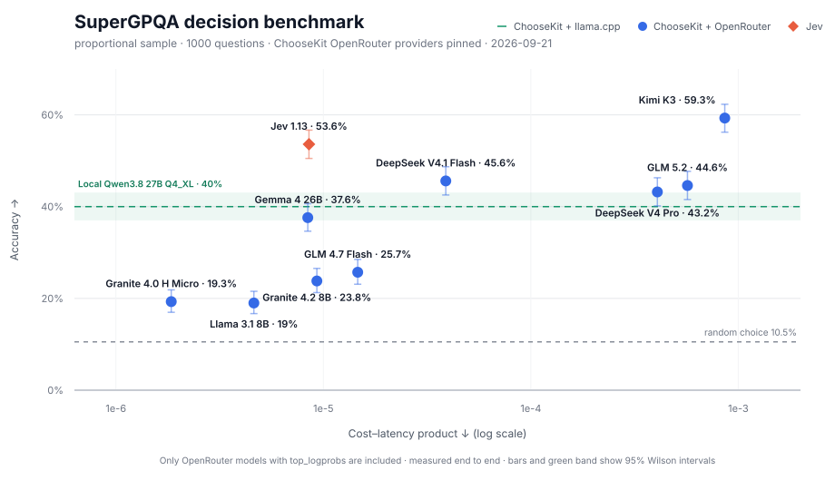

# choosekit

`choosekit` scores a finite set of choices and returns a typed decision with a probability distribution. It accepts `text and images` through llama.cpp, Ollama, and OpenRouter.



The chart compares accuracy with a lower-is-better cost-latency product. The green line and confidence band show local Qwen3.8 27B Q4_XL accuracy; it has no cloud cost coordinate. [Method and reproduction](benchmarks/README.md#supergpqa)

| Model | Accuracy | Cost / 1,000 decisions | Decisions/s |
|---|---:|---:|---:|
| Granite 4.0 H Micro | 19.3% | $0.0053 | 2.84 |
| Llama 3.1 8B | 19.0% | $0.0061 | 1.33 |
| GLM 4.7 Flash | 25.7% | $0.0172 | 1.18 |
| Gemma 4 26B | 37.6% | $0.0184 | 2.19 |
| Jev 1.13 | 53.6% | $0.0244 | 2.86 |
| Granite 4.2 8B | 23.8% | $0.0293 | 3.15 |
| DeepSeek V4.1 Flash | 45.6% | $0.0544 | 1.40 |
| DeepSeek V4 Pro | 43.2% | $0.3588 | 0.88 |
| GLM 5.2 | 44.6% | $0.3932 | 0.69 |
| Kimi K3 | 59.3% | $0.6243 | 0.73 |

## Install

Library:

```sh
npm install choosekit
```

MCP server:

```sh
npm install --global choosekit-mcp
```

## Why

Agents often need to choose from known options:

- approve or reject an action;
- route a message;
- select the next tool;
- classify evidence;
- choose one legal move.

`choosekit` scores choices using the model's conditional log probabilities at the token branches that distinguish them.

The project was inspired by [Jev and the System One model interface](https://typesafe.ai/blog/introducing-system-one-models-and-jev): application state in, typed probabilistic decisions out. Jev is a specialized hosted model. `choosekit` brings the same typed decision interface to general-purpose language models. The llama.cpp and Ollama backends run on infrastructure you choose; OpenRouter provides hosted inference.

`choosekit` is an independent project with no affiliation to TypeSafe or Jev.

## MCP server

[`choosekit-mcp`](packages/choosekit-mcp/README.md) exposes choosekit through llama.cpp, Ollama, or OpenRouter as a read-only stdio tool for Claude Code, Codex, and OpenCode. Select the backend and configure it with environment variables when starting the MCP server.

## llama.cpp

```ts
import { fromLlamaCpp } from "choosekit/llama-cpp";

const choose = fromLlamaCpp({
  baseURL: "http://127.0.0.1:8080/",
  mode: "labels",
});

const decision = await choose({
  context: "The deployment modifies production data and no backup exists.",
  question: "Should this action run without human approval?",
  choices: {
    yes: "The action is reversible, low-impact, and within scope.",
    no: "The action is destructive, irreversible, or broader than requested.",
  },
  signal: AbortSignal.timeout(30_000),
});

console.log(decision.choice);       // "no"
console.log(decision.distribution); // { yes: ..., no: ... }
```

The llama.cpp backend requires its native `/tokenize` and `/completion` endpoints. `minimal-prefix` is available only with this backend.

The library has no telemetry.

## Ollama

```ts
import { fromOllama } from "choosekit/ollama";

const choose = fromOllama({ model: "your-model" });
```

`model` is required. The adapter uses `http://127.0.0.1:11434/` by default and supports only `labels` mode with up to 20 choices. It requires Ollama 0.12.11 or newer.

## OpenRouter

```ts
import { fromOpenRouter } from "choosekit/openrouter";

const choose = fromOpenRouter({
  apiKey: process.env.OPENROUTER_API_KEY!,
  model: "your-model",
});
```

The OpenRouter backend supports models and providers that return first-token `top_logprobs`, with up to 20 choices. It sends the prompt to OpenRouter and requests reasoning to be disabled.

Returned probabilities are normalized across the supplied choices and are not calibrated correctness estimates.

OpenRouter may route the same model through different providers. Set `provider: "provider-slug"` to use only that provider and disable fallback.

## Image inputs

llama.cpp, Ollama, and OpenRouter can score choices from images when the selected model supports vision. Pass raw base64 data with its media type:

```ts
import { readFile } from "node:fs/promises";

const decision = await choose({
  context: "Inspect the attached screenshot.",
  question: "Which state is the interface in?",
  choices: {
    ready: "The interface is ready for input.",
    loading: "The interface is still loading.",
  },
  images: [{
    mediaType: "image/png",
    base64: (await readFile("screenshot.png")).toString("base64"),
  }],
});
```

Supported media types are PNG, JPEG, and WebP. llama.cpp image inputs currently support `labels` mode only.

The MCP server accepts image file paths through `imagePaths` in `labels` mode. Paths are resolved from the server's working directory by default; set `CHOOSEKIT_IMAGE_ROOT` to use another root. Every image must remain within that root and be a PNG, JPEG, or WebP file. With OpenRouter, the image contents are sent to the remote service.

## Scoring modes

| Mode | Candidate representation | Use when |
|---|---|---|
| `labels` | `A`, `B`, `C`, ... | Default. Up to 26 choices with llama.cpp or 20 with Ollama or OpenRouter. |
| `minimal-prefix` | Original JSON-quoted keys | llama.cpp only. Use when key names should influence the decision. |

Choices for which the backend returns no logprob receive zero probability.

In `labels` mode, choices are shown to the model as `A`, `B`, `C` instead of their original keys. For example, `refund: "Issue the refund"` is shown as `"A": "Issue the refund"`. Each description must therefore make the option clear. `choosekit` maps the selected label back to the original key.

`minimal-prefix` walks the token tree until every key is distinguishable. For keys such as `watermelon` and `watermelon juice`, the shared token path is handled once and scoring stops when the paths separate.

## Return value

`choose()` resolves to:

```ts
{
  choice,          // selected caller key
  distribution,    // normalized probability for every supplied key
  scores,          // backend log-probability score for every key
  margin,          // largest probability minus the second largest
  entropy,         // Shannon entropy in nats
  boundaryTokens,  // prompt tokens rolled back at a tokenization boundary
  usage,           // backend work, when reported
}
```

The result and its nested records are immutable. Each call is stateless. The caller controls action execution, inference retries, and model selection.

## Prompt formatting

`context` is copied unchanged to the start of the scoring prompt. The default formatter then appends the question, choice descriptions, and an answer marker.

Use `formatPrompt` only when you need custom prompt formatting. The result must preserve `context` as an unchanged prefix so an existing server-side prefix cache can still be reused.

## Custom scorer

Use `createChooser` with any backend that can return one comparable conditional log-probability score per candidate:

```ts
import { createChooser, type Scorer } from "choosekit";

const scorer: Scorer = async ({ prompt, candidates, signal }) => ({
  logprobs: await scoreCandidateSequences(prompt, candidates, signal),
});

const choose = createChooser(scorer);
```

Scores use natural logarithms and must be at most zero.

## SemIf comparison

The local adapter was compared with `typesafe/jev-1.13` on SemIf's official 144-row `authored144` benchmark, which covers evidence interpretation, rule application, and candidate selection. The local model was **Qwen 3.8 27B Q4_XL** served by llama.cpp on an **NVIDIA RTX 4090**. The Qwen run used the default A/B/C mode. The model was already loaded, and requests were sent one at a time to a llama.cpp server on the same machine.

| Metric | Qwen 3.8 27B Q4_XL + choosekit | Jev 1.13 |
|---|---:|---:|
| Accuracy | 96.53% (139/144) | 96.53% (139/144) |
| Median latency (p50) | 239 ms | 368 ms |
| 95th percentile latency (p95) | 286 ms | 546 ms |
| Throughput | 4.02 decisions/s | 2.43 decisions/s |

Both systems got 139 of 144 cases right, but not the same 139. They share only 2 of their 5 mistakes; each makes 3 mistakes the other avoids. On the 2 shared failures, they selected different incorrect options.

These results are specific to this 144-case benchmark, and performance can differ on other decision workloads. Latency is end-to-end. The Qwen server ran on the same machine. Jev was accessed through a hosted API. The timings therefore include different transport overhead. The repository includes an exact copy of SemIf's [`authored144.jsonl`](https://github.com/TheoLeeCJ/SemIf/blob/b9cb32537e78be65f19abfcb1de8fc504b627d84/benchmarks/data/authored144.jsonl), its MIT license, and the [reproduction commands](benchmarks/README.md).

### Probability examples

[`eafc22c8c40df3932a8e`](benchmarks/data/semif-authored144.jsonl#L112) asks whether the crate is currently in storage. The protocol gives the inventory priority; the current inventory and desk-log entries are missing.

| Choice | Qwen probability | Jev probability |
|---|---:|---:|
| Supported | 1.893% | 1.000% |
| Contradicted | 0.354% | 0.000% |
| **Insufficient evidence (selected by both)** | **97.753%** | **99.000%** |

[`f46f392ef9e9e9df564b`](benchmarks/data/semif-authored144.jsonl#L76) asks whether permission to scan a notebook is still valid. The owner authorized scanning on Monday; the record omits all later permission changes.

| Choice | Qwen probability | Jev probability |
|---|---:|---:|
| Supported | 2.366% | 0.000% |
| **Insufficient evidence (selected by both)** | **97.605%** | **99.000%** |
| Contradicted | 0.029% | 1.000% |

The Qwen + llama.cpp probabilities shown here are [uncalibrated](https://proceedings.mlr.press/v70/guo17a.html). [Jev is trained for calibrated decisions](https://typesafe.ai/blog/introducing-system-one-models-and-jev). The distributions look similar in these examples.

### Distribution comparison

All 144 cases and all 432 option probabilities were matched by case and choice ID.

Total variation distance (TVD) compares two complete probability distributions. A TVD of 0% means they are identical; 100% means each system assigns probability to entirely different choices. Pearson correlation measures whether individual probabilities rise and fall together, with 1.0 indicating perfect linear correlation.

| Comparison | Result |
|---|---:|
| Both systems selected the same choice | 94.44% (136/144) |
| Pearson correlation across all 432 probabilities | 0.948 |
| Median total variation distance | 2.52% |
| Mean total variation distance | 9.36% |
| Cases with TVD at or below 5% | 64.58% (93/144) |
| Cases with TVD at or below 10% | 77.08% (111/144) |
| Cases with TVD above 20% | 14.58% (21/144) |

## Requirements

- Node.js 20 or newer.
- The `choosekit` package has no runtime dependencies, model downloads, installation hooks, or bundled inference servers.

[Apache-2.0](LICENSE). Copyright 2026 NotXf1le.
